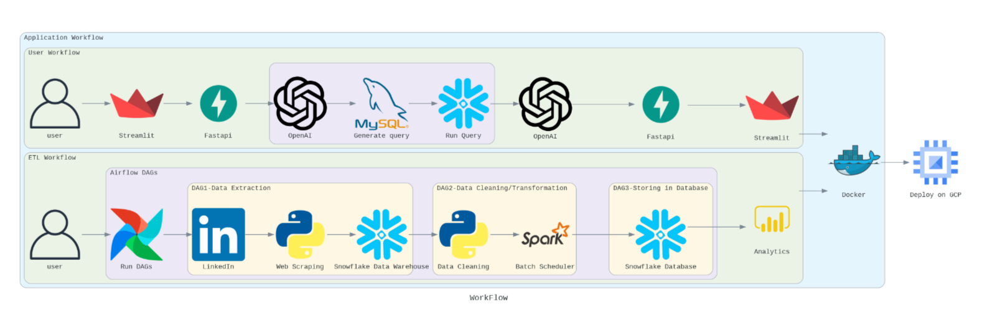

# Crafting Intelligence through Analytics

Codelabs - https://codelabs-preview.appspot.com/?file_id=1UmA1PbuQUKTWYhzkq_1JBijOSzBVlyjgwNkJzHTicBY#3

# Technologies Used

Description

This project entails the integration of Airflow, Docker, FastAPI, and Streamlit to create a robust end-to-end solution for job-related information retrieval and interaction. The primary scope involves utilizing web scraping tools and techniques to extract relevant job data from LinkedIn. The Airflow framework will be employed to orchestrate and schedule the scraping process, ensuring timely updates and data freshness. Docker containers will facilitate seamless deployment and scalability of the application. FastAPI will be leveraged to build a RESTful API, enabling efficient communication between components. Streamlit, as a user interface framework, will be employed to create an interactive front-end for end-users to engage with the chatbot.

In addition to web scraping, natural language processing (NLP) and machine learning technologies will be integrated to refine and process the extracted job information. These technologies will empower the language model within the chatbot, enhancing its ability to understand, generate, and respond to job-related queries with contextual accuracy.

Expected deliverables encompass a comprehensive dataset of job-related information sourced from LinkedIn, a scalable and containerized application architecture using Docker, a well-orchestrated workflow managed by Airflow, a RESTful API developed with FastAPI for seamless communication, and a user-friendly, interactive interface powered by Streamlit. The integration of NLP and machine learning will contribute to the sophistication of the language model, ensuring a more nuanced and context-aware interaction.

# Architecture:

